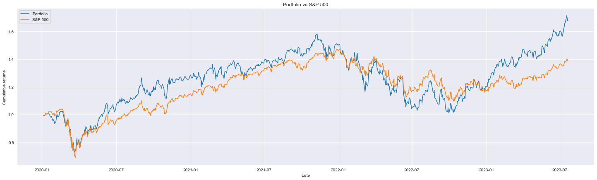

# Diversified Portfolio by Clustering

This project aims to create a diversified portfolio by clustering stocks. The idea is to cluster stocks based on their historical data, and then pick three stocks from each cluster to form a diversified portfolio. The assumption is that stocks in the same cluster are similar to each other in terms of their price movements, and stocks in different clusters are different from each other. Therefore, picking one stock from each cluster will result in a diversified portfolio.

## Data

The data used in this project is from [Yahoo Finance](https://finance.yahoo.com/). The data to perform the clustering is downloaded for the period from 2013-01-01 to 2019-12-31. And in order to backtest the performance of the created portfolio (againt the S&P500 index), the data used is of the period from 2020-01-01 till today.

## Methodology

The methodology is as follows :

1. Download the historical data of the stocks from Yahoo Finance.   
2. Calculate the selected features for each stock.
3. Perform K-means clustering on the stocks based on the chosen features (we do a GridSearch, but still chose K=4).
4. Pick one stock from each cluster to form a diversified portfolio.
5. Backtest the performance of the portfolio against the S&P500 index.
6. Seek some explainability in the results thanks to SHAP values.

## Results

The results are as follows :

The performance of the diversified portfolio is slightly better than the S&P500 index. The comparison based on *Cumulative Return* is given by this plot : 

